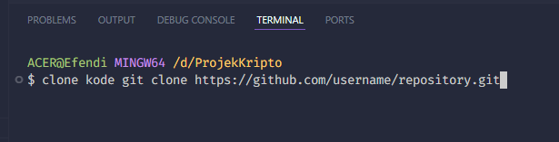

# projekkripto
Projek Kripto membuat GUI untuk menguji S-BOX dengan opsi (NL, SAC, LAC, DAP, BIC-SAC, BIC-NL)

## WELCOME to My Repository
disini saya menjelaskan bagaimana menjalankan GUI Streamlit.

### Langkah 1
clone kode
git clone https://github.com/efendi7/projekkripto.git

